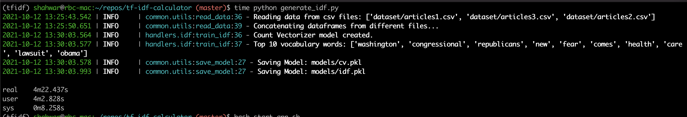
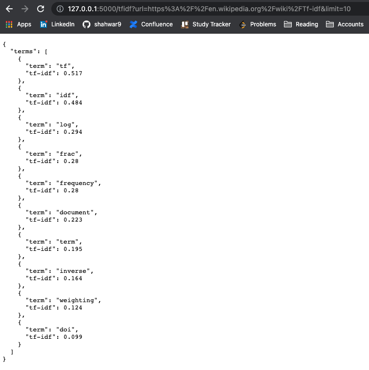
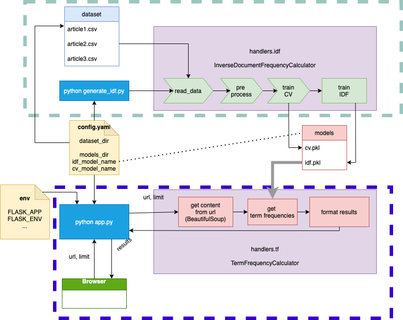
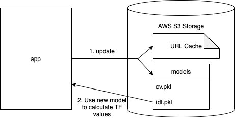

# tf-idf-calculator
A Flask based backend API to calculate Term Frequencies of content within a
URL and returns top N terms with their TF values. A few keynotes regarding this application:

- IDF Model is calculated offline using the dataset: [All News Dataset](https://www.kaggle.com/snapcrack/all-the-news)
- IDF Model is calculated using sklearn library:
    - [TfidfTransformer](https://scikit-learn.org/stable/modules/generated/sklearn.feature_extraction.text.TfidfTransformer.html#sklearn.feature_extraction.text.TfidfTransformer)
    - [CountVectorizer](https://scikit-learn.org/stable/modules/generated/sklearn.feature_extraction.text.CountVectorizer.html#sklearn.feature_extraction.text.CountVectorizer)
- Flask app then uses IDF model to calculate Term Frequencies. 

# Pre-requisites
In order to run this application and test it, `conda` must be installed and `conda` command should be working on your system.
Here are some resources to help with conda:
- [Miniconda documentation](https://docs.conda.io/en/latest/miniconda.html)

Please install conda first.

### Create Conda Environment
You can see there is a file called `env.yaml` in the root of this repository. This file can be used to 
create the required environment for testing this application. Here is the command to create the environment:

```buildoutcfg
$ conda env create -f env.yaml
```

This will create a conda environment named: `tfidf-env`

Before running any command related to the application, please run:
```buildoutcfg
$ conda activate tfidf-env
```

# Config file
There is a config file for the application called `config.yaml`.
This config file is to pass our desired parameters to the application. 

Currently, the config file is not complicated at all. It looks like this:
```yaml
models_dir: models # Specify path in which models will be present.
cv_model_name: cv.pkl # Name of the count vectorizer model.
idf_model_name: idf.pkl # Name of the idf model file.
dataset_dir: dataset # Directory or path in which the dataset is present.
```

A small description is added above to explain what each parameter actually is. 
A few key points:
- `dataset_dir` is only used by IDF Calculation Module to read from the dataset. 
- `cv_model_name`, `idf_model_name`, `models_dir`: Are used both by TF and IDF Modules to retrieve or save the models respectively.

# Running the application
The models calculated offline are also present in the repository under `models` directory.
If you do not want to wait longer for the model to build on the whole dataset. You can skip the step of
calculating `IDF Models`.

## IDF Model (Optional)
You can generate IDF model by running the following command:

```buildoutcfg
$ python generate_idf.py
```

The above command performs following:
- Reads config from `config.yaml`
- Reads dataset from `dataset_dir`. 3 Article files from Dataset mentioned above should be present in this `dataset_dir`.
- Trains a CountVectorizer and TfidfTransformer model and places it under `models` directory specified.

This step is optional because models have already been added along with this repository as `pickle` files. 

### Benchmark
The `generate_idf.py` script almost takes 4 minutes and 22 seconds to run. Here is what to expect when running this script:


## Flask app
Once the models are ready. You can run the Flask app. 
Please make sure `conda` environment is activated before running this command:

```buildoutcfg
$ bash start_app.sh
```
After running the command above, the console should look like this:


This script will do the following:
- Setup some environment variables for flask. Like `FLASK_APP`, `FLASK_ENV`
- Run the Flask app pointing to `app.py`

`app.py` script does the following:
- Reads the config from `config.yaml`, this is to make sure it knows where IDF Models are placed. 
- Creates a route `/tfidf` which expects 2 arguments:
    - url: A string URL to any webpage.
    - limit: An integer value to select top n number of terms from webpage specified in url. 

### Testing Application
- The application by default runs on the address: `127.0.0.0:5000`. The port and address can also be configured, we keep them default to avoid unnecessary complexity for the scope of this project. 

- Enter following in your web browser:
`http://127.0.0.1:5000/tfidf?url=https%3A%2F%2Fen.wikipedia.org%2Fwiki%2FTf-idf&limit=10`
  To see the results of the application like following:
  


# Integration Tests
The integration test runs on dummy small dataset and using the same API as used by the actual application.
- `integration-test.py` file is used to run the integration test as:
```buildoutcfg
$ python integration-test.py
```

# Architecture of the application
Current architecture and the flow of the application is explained below:



A few points to appreciate the design in the diagram above:

- Grey dotted area signifies offline part of the application.
- Blue dotted area signifies online part of the application.
- `handlers` directory in the repository consists of Tf and Idf handlers. 
- BeautifulSoup library was used to extract text content from the HTML response when we try to access the URL.
- `models` are shared between `offline` and `online` parts of the application.
- Here is small flow:
  - Offline part uses top pipeline to calculate the cv and idf models.
  - When application goes online, the models in previous step are used to calculate term frequencies.
  - Results are formatted according to the requirement at the last step of online part.
  - Formatted results are published to the browser.
  
# Improvements

### How would you design a system that, in addition to computing TF-IDF counts for the provided URL upon request, updates the IDF statistics whenever TF-IDF for a previously unseen URL is requested?
If the application needs to keep a record of documents seen and also update the models, we need to take care of 2 things in this case:

1. Keep track of documents previously seen (unseen URLS)
2. Update models after each URL request.

#### Keep track of documents previously seen (unseen URLS)
For this, we can simply maintain a `url cache` which would keep a track of what URLS we have seen before.
A few keynotes to maintain the URL cache:
- This `url cache` should be stored somewhere like an S3 object storage or Redis.
- The reason is that if the application is restarted, previously seen URLs can be restored from the `url cache`

#### Updating Models
Since we have taken care of the URL in the previous step, we now just have to see how should we update our models.
Now that model updates are also important. We need to store model files on an Object Storage like AWS S3 as well.

For updating models, instead of just using:
```python
cv.transform(content_from_url)
```

We have to use:
```python
cv.fit_transform(content_from_url)
```

`fit_transform` also fits the existing model to the new data coming. 

This can easily be done by implementing a method which is part of `handlers.idf.InverseDocumentFrequencyCalculator` class:

```python
    def update_idf(self, new_dataset):
        raise NotImplementedError("IDF Update is not implemented yet.")
```

One decision that might need to be made is that "When" to update the model? There are 2 options:
1. Updating model before responding to user request. 
   - Tradeoff: User will be seeing results of an updated idf model, but it will reduce throughput and user has to wait for the model to be updated. 
2. Updating the model after user request is served.
   - Tradeoff: User sees results from older idf model, but the user won't have to wait for the request and models can be updated on the side by spawning a process.
  
Figure below summarizes the idea of updates:




### How would you deploy this on AWS or GCP?
Deploying to AWS needs following resources:

- AWS EC2 Instance:
    - EC2 instance hooked with CI/CD pipeline. 
    - As soon as there is a commit to a `privileged branch`, CICD pipeline checks out the new code and restarts the Flask app.
    - A `privileged branch` is either a staging or master branch.
    - `staging` branch refers to development EC2 instance. 
    -  `master` branch refers to production EC2 instance.
    - Reason for having 2 environments is for testing purposes and making sure we are not right away deploying to `production`.
  
- AWS S3 Storage: AWS S3 storage can be used to store:
    - URL Cache 
    - Model files
  
#### Versioning
One thing that needs to probably be implemented is to have versioning of the models. This is in case we would like to fall back 
to some previous version of model because of processing a URL that has bad data in it. If something like this happens, versioning of models will
help with rolling back of models.
  

## References:
Thanks to following blog posts for refreshing my knowledge of Tf-Idf and creating a Flask app:
- [Demonstrating Calculation of TF-IDF from Sklearn](https://medium.com/analytics-vidhya/demonstrating-calculation-of-tf-idf-from-sklearn-4f9526e7e78b)
- [Tutorial: Extracting Keywords with TF-IDF and Python's Scikit-Learn](https://kavita-ganesan.com/extracting-keywords-from-text-tfidf/#.YWTuyNMVbfA)
- [How to Make a Web Application Using Flask in Python](https://www.digitalocean.com/community/tutorials/how-to-make-a-web-application-using-flask-in-python-3)