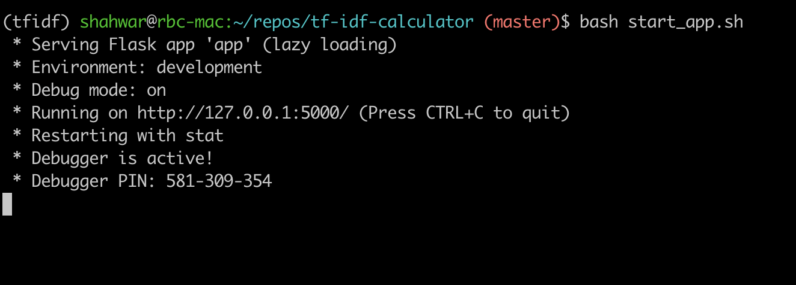

# tf-idf-calculator
A Flask based backend API to calculate Term Frequencies of content within a
URL and returns top N terms with their TF values. A few keynotes regarding this application:

- IDF Model is calculated offline using the dataset: [All News Dataset](https://www.kaggle.com/snapcrack/all-the-news)
- IDF Model is calculated using sklearn library:
    - [TfidfTransformer](https://scikit-learn.org/stable/modules/generated/sklearn.feature_extraction.text.TfidfTransformer.html#sklearn.feature_extraction.text.TfidfTransformer)
    - [CountVectorizer](https://scikit-learn.org/stable/modules/generated/sklearn.feature_extraction.text.CountVectorizer.html#sklearn.feature_extraction.text.CountVectorizer)
- Flask app then uses IDF model to calculate Term Frequencies. 

# Pre-requisites
In order to run this application and test it, `conda` must be installed and `conda` command should be working on your system.
Here are some resources to help with conda:
- [Miniconda documentation](https://docs.conda.io/en/latest/miniconda.html)

Please install conda first.

### Create Conda Environment
You can see there is a file called `env.yaml` in the root of this repository. This file can be used to 
create the required environment for testing this application. Here is the command to create the environment:

```buildoutcfg
$ conda env create -f env.yaml
```

This will create a conda environment named: `tfidf-env`

Before running any command related to the application, please run:
```buildoutcfg
$ conda activate tfidf-env
```

# Config file
There is a config file for the application called `config.yaml`.
This config file is to pass our desired parameters to the application. 

Currently, the config file is not complicated at all. It looks like this:
```yaml
models_dir: models # Specify path in which models will be present.
cv_model_name: cv.pkl # Name of the count vectorizer model.
idf_model_name: idf.pkl # Name of the idf model file.
dataset_dir: dataset # Directory or path in which the dataset is present.
```

A small description is added above to explain what each parameter actually is. 
A few key points:
- `dataset_dir` is only used by IDF Calculation Module to read from the dataset. 
- `cv_model_name`, `idf_model_name`, `models_dir`: Are used both by TF and IDF Modules to retrieve or save the models respectively.

# Running the application
The models calculated offline are also present in the repository under `models` directory.
If you do not want to wait longer for the model to build on the whole dataset. You can skip the step of
calculating `IDF Models`.

## IDF Model (Optional)
You can generate IDF model by running the following command:

```buildoutcfg
$ python generate_idf.py
```

The above command performs following:
- Reads config from `config.yaml`
- Reads dataset from `dataset_dir`. 3 Article files from Dataset mentioned above should be present in this `dataset_dir`.
- Trains a CountVectorizer and TfidfTransformer model and places it under `models` directory specified.

This step is optional because models have already been added along with this repository as `pickle` files. 

## Flask app
Once the models are ready. You can run the Flask app. 
Please make sure `conda` environment is activated before running this command:

```buildoutcfg
$ bash start_app.sh
```
After running the command above, the console should look like this:



This script will do the following:
- Setup some environment variables for flask. Like `FLASK_APP`, `FLASK_ENV`
- Run the Flask app pointing to `app.py`

`app.py` script does the following:
- Reads the config from `config.yaml`, this is to make sure it knows where IDF Models are placed. 
- Creates a route `/tfidf` which expects 2 arguments:
    - url: A string URL to any webpage.
    - limit: An integer value to select top n number of terms from webpage specified in url. 

### Testing Application
- The application by default runs on the address: `127.0.0.0:5000`. The port and address can also be configured, we keep them default to avoid unnecessary complexity for the scope of this project. 

- Enter following in your web browser:
`http://127.0.0.1:5000/tfidf?url=https%3A%2F%2Fen.wikipedia.org%2Fwiki%2FTf-idf&limit=10`
  To see the results of the application. 


# Integration Tests


## References:
Thanks to following blog posts for refreshing my knowledge of Tf-Idf and creating a Flask app:
- [Demonstrating Calculation of TF-IDF from Sklearn](https://medium.com/analytics-vidhya/demonstrating-calculation-of-tf-idf-from-sklearn-4f9526e7e78b)
- [Tutorial: Extracting Keywords with TF-IDF and Python's Scikit-Learn](https://kavita-ganesan.com/extracting-keywords-from-text-tfidf/#.YWTuyNMVbfA)
- [How to Make a Web Application Using Flask in Python](https://www.digitalocean.com/community/tutorials/how-to-make-a-web-application-using-flask-in-python-3)